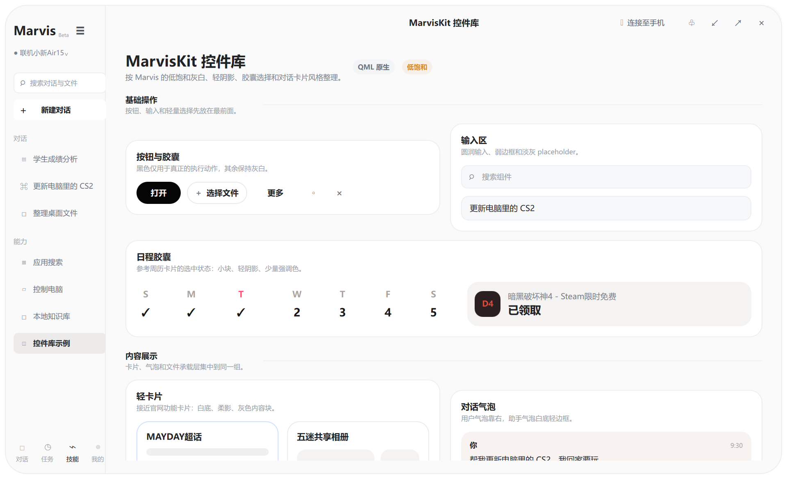

# MarvisKit QML

<p align="center">
  
</p>

<p align="center">
  <a href="https://github.com/sorrowfeng/marvis-kit-qml/actions/workflows/ci.yml"></a>
  
  
  
  <a href="LICENSE"></a>
</p>

MarvisKit QML is an unofficial Qt Quick/QML control library for building quiet,
rounded, low-saturation desktop interfaces inspired by Marvis-style product UI.
It ships as a reusable QML module plus a gallery app that demonstrates a
desktop shell, chat surface, document preview, and component catalog.

This project is not affiliated with Tencent or the official Marvis product.

## Preview

<p align="center">
  
</p>

## Highlights

- Reusable QML module: `import MarvisKit 1.0`.
- 50+ styled desktop controls for actions, inputs, selection, feedback, data, navigation, overlays, and containers.
- Marvis-like visual language: white/soft-gray panels, rounded shells, low-saturation accents, light borders, and restrained motion.
- Interactive gallery states for hover, pressed, selected, expanded, dismissed, paging, drawer/popover opening, sorting, row selection, and more.
- Windows gallery chrome with transparent background, disabled native DWM rounding, and an antialiased QML rounded shell.
- CI-backed Windows Qt build with Qt 6.9.1 and Ninja.

## Component Coverage

MarvisKit includes controls such as:

- Actions: `MvButton`, `MvIconButton`, `MvMenuButton`, `MvToolbar`, `MvCommandItem`
- Inputs: `MvTextField`, `MvTextArea`, `MvSearchField`, `MvComboBox`, `MvSlider`, `MvRangeSlider`, `MvDial`, `MvStepper`, `MvCalendar`
- Selection: `MvChip`, `MvToggle`, `MvCheckbox`, `MvRadio`, `MvSegmentedControl`, `MvTabBar`, `MvPagination`, `MvPageIndicator`, `MvColorSwatch`
- Feedback: `MvBadge`, `MvStatusDot`, `MvProgressBar`, `MvSpinner`, `MvToast`, `MvNotification`, `MvDialog`, `MvPopover`, `MvDrawer`, `MvToolTip`
- Content and layout: `MvPanel`, `MvFrame`, `MvGroupBox`, `MvCard`, `MvTable`, `MvTreeItem`, `MvListItem`, `MvNavItem`, `MvFileCard`, `MvMessageBubble`, `MvBreadcrumb`, `MvAvatar`, `MvAvatarGroup`, `MvShortcut`, `MvScrollBar`, `MvSplitView`

See [Components](docs/components.md) for the full list.

## Requirements

- Qt 6.9 or newer
- CMake 3.24 or newer
- A C++20 compiler

The gallery is primarily exercised on Windows because it includes custom
frameless window chrome. The reusable QML controls are regular Qt Quick items.

## Quick Start

Configure and build:

```powershell
cmake -S . -B build -DMARVIS_KIT_BUILD_EXAMPLES=ON
cmake --build build --config Release
```

Run the gallery:

```powershell
.\build\Release\MarvisKitGallery.exe
.\build\Release\MarvisKitGallery.exe --kit
```

On Windows with a local Qt install:

```powershell
& "C:\Qt\6.9.1\msvc2022_64\bin\qt-cmake.bat" -S . -B build -G "Visual Studio 17 2022" -A x64
cmake --build build --config Release
```

## Use In Your App

Add the library directory from CMake:

```cmake
add_subdirectory(path/to/marvis-kit-qml/src/MarvisKit)

target_link_libraries(YourApp
    PRIVATE
        MarvisKit
        MarvisKitplugin
)

qt_import_qml_plugins(YourApp)
```

For static QML plugin imports, add this in your app entry point:

```cpp
#include <QtQml/qqmlextensionplugin.h>

Q_IMPORT_QML_PLUGIN(MarvisKitPlugin)
```

Then import the module in QML:

```qml
import MarvisKit 1.0 as Kit

Kit.MvButton {
    text: "Open"
    accent: true
}
```

## Repository Layout

```text
src/MarvisKit/          Reusable QML control module
examples/gallery/       Desktop gallery app and Marvis-like shell
docs/                   Usage, component, and architecture notes
docs/assets/            README screenshots
.github/workflows/      CI build workflow
```

## Documentation

- [Getting Started](docs/getting-started.md)
- [Components](docs/components.md)
- [Architecture](docs/architecture.md)
- [Changelog](CHANGELOG.md)

## License

MIT. See [LICENSE](LICENSE).
